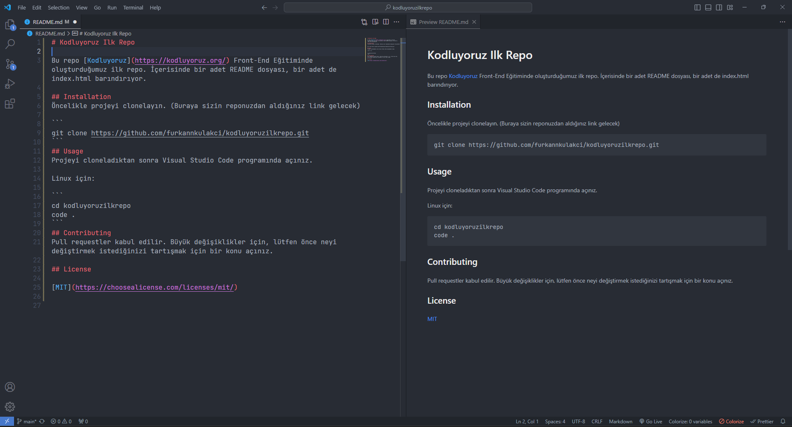

# Kodluyoruz Ilk Repo

Bu repo [Kodluyoruz](https://kodluyoruz.org/) Front-End Eğitiminde oluşturduğumuz ilk repo. İçerisinde bir adet README dosyası, bir adet de index.html barındırıyor.

## Installation 
Öncelikle projeyi clonelayın. (Buraya sizin reponuzdan aldığınız link gelecek)

```
git clone https://github.com/furkannkulakci/kodluyoruzilkrepo.git
```
## Usage
Projeyi cloneladıktan sonra Visual Studio Code programında açınız.

Linux için:

```
cd kodluyoruzilkrepo
code .
```
## Contributing
Pull requestler kabul edilir. Büyük değişiklikler için, lütfen önce neyi değiştirmek istediğinizi tartışmak için bir konu açınız.

## License 🪪 

[MIT](https://choosealicense.com/licenses/mit/)

---

Proje görseli 🖼️



